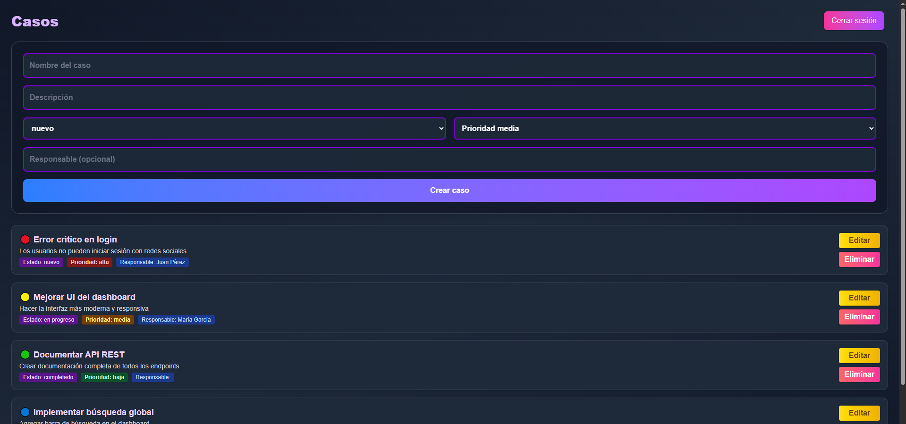

# 🚀 Sistema de Gestión de Casos – Fullstack (Next.js + Express + JWT)

Aplicación fullstack para la gestión de casos, diseñada con arquitectura modular, autenticación segura mediante JWT y una interfaz moderna y responsiva creada con Next.js.

Este proyecto demuestra habilidades clave para pruebas técnicas: CRUD real, autenticación, tipado estricto, diseño moderno, separación frontend/backend y buenas prácticas de arquitectura.

---

## 🌐 Demo en Vivo


- **Frontend:** [https://gestion-casos-fullstack.onrender.com/](https://gestion-casos-fullstack.onrender.com/)
- **Backend:** [https://gestion-casos-fullstack-backend.onrender.com/](https://gestion-casos-fullstack-backend.onrender.com/)

> **Nota:** El backend en Render usa almacenamiento en memoria. Los datos se reinician cuando el servidor se duerme o reinicia.

---

## 📸 Vista Previa


<div align="center">
  
  
</div>

---

## 🏗️ Arquitectura del Proyecto

```
proyecto/
├── backend-casos/
│   ├── package.json
│   ├── tsconfig.json
│   └── src/
│       ├── index.ts              # Punto de entrada del backend
│       ├── types.ts              # Tipos TypeScript para los casos
│       ├── middleware/
│       │   └── auth.ts           # Middleware JWT
│       ├── routes/
│       │   ├── auth.ts           # Rutas de autenticación
│       │   └── casos.ts          # CRUD de casos
│       ├── dtos/
│       │   ├── CreateCasoDTO.ts  # DTO para crear casos (validado)
│       │   └── UpdateCasoDTO.ts  # DTO para actualizar casos
│       ├── filters/
│       │   └── HttpExceptionFilter.ts  # Manejo global de errores
│       ├── seeds/
│       │   └── seedCasos.ts      # Datos de ejemplo (más de 10 casos)
│       └── utils/
│           └── validation.ts     # Middleware de validación DTO
└── frontend-casos/
    ├── package.json
    ├── tsconfig.json
    ├── public/
    └── src/
        ├── app/
        │   ├── layout.tsx
        │   ├── globals.css
        │   ├── page.tsx
        │   ├── login/
        │   │   └── page.tsx
        │   └── casos/
        │       ├── page.tsx              # Vista de lista de casos
        │       ├── crear/page.tsx        # Vista para crear caso
        │       └── editar/[id]/page.tsx  # Vista para editar caso
        ├── components/
        │   ├── CasoForm.tsx
        │   ├── ConfirmModal.tsx          # Modal de confirmación para eliminar
        │   ├── Spinner.tsx               # Indicador de carga
        │   └── index.ts                  # Exporta componentes
        └── lib/
            └── api.ts
```

---


## 🛠️ Tecnologías Utilizadas

### Frontend

- Next.js (App Router)
- TypeScript
- Tailwind CSS
- LocalStorage para guardar el token

### Backend

- Node.js + Express.js
- JWT para autenticación
- TypeScript
- Almacenamiento temporal en memoria

---

## 🔐 Variables de Entorno

### Backend (`backend-casos`)

Crea un archivo `.env`:

```env
JWT_SECRET=tu_secreto_personal
PORT=4000
```

### Frontend (`frontend-casos`)

Crea un archivo `.env.local`:

```env
NEXT_PUBLIC_API_URL=http://localhost:4000
```

---

## 📌 Funcionalidades

### Backend

- Login con JWT
- Listar casos
- Crear casos
- Editar casos
- Eliminar casos
- Middleware de autenticación
- Tipado estricto y validado

### Modelo de un Caso

| Campo        | Tipo    | Descripción                |
|--------------|---------|----------------------------|
| id           | UUID    | Identificador único        |
| nombre       | string  | Nombre del caso            |
| descripcion  | string  | Descripción (opcional)     |
| estado       | string  | Estado (ej: "nuevo")       |
| prioridad    | string  | baja, media, alta          |
| responsable  | string  | Responsable (opcional)     |

### Endpoints

| Método | Ruta           | Descripción                    |
|--------|----------------|--------------------------------|
| POST   | /auth/login    | Obtiene el JWT                 |
| GET    | /casos         | Listar casos (requiere JWT)    |
| POST   | /casos         | Crear caso (JWT)               |
| PUT    | /casos/:id     | Actualizar caso (JWT)          |
| DELETE | /casos/:id     | Eliminar caso (JWT)            |

### Usuario Demo

| Usuario           | Contraseña |
|-------------------|------------|
| demo@demo.com     | Demo1234   |

### Frontend

- Login con persistencia de sesión
- Vista de lista de casos
- Vista separada para crear caso
- Vista separada para editar caso
- Modal de confirmación para eliminar
- UI moderna y responsiva con Tailwind
- Indicadores de carga (spinner)
- Mensajes de error y validación en formularios
- Botón de logout siempre visible
- Manejo de tokens en localStorage

---

## Mejoras Implementadas

Este proyecto incluye mejoras clave que lo hacen profesional y listo para producción:

### 1. ✅ Validación Real con `class-validator`

Cada DTO valida automáticamente los datos recibidos en POST/PUT:

```typescript
// CreateCasoDTO.ts
export class CreateCasoDTO {
  @IsString()
  @IsNotEmpty()
  nombre!: string;

  @IsIn(['baja', 'media', 'alta'])
  @IsNotEmpty()
  prioridad!: 'baja' | 'media' | 'alta';

  @IsString()
  @IsOptional()
  responsable?: string;
}
```

**Beneficios:** Datos siempre correctos, respuestas de error claras, sin validación manual.

---

### 2. ✅ Manejo de Errores Global

Un `HttpExceptionFilter` devuelve errores con formato limpio y consistente:

```json
{
  "statusCode": 400,
  "message": "Validation failed: nombre: nombre should not be empty",
  "timestamp": "2025-11-13T10:30:00.000Z",
  "path": "/casos"
}
```

**Beneficios:** Arquitectura profesional, debugging fácil, respuestas predecibles.

---

### 3. ✅ DTOs Limpios y Tipados

Separación clara entre crear y actualizar:

- **CreateCasoDTO:** Campos requeridos para creación
- **UpdateCasoDTO:** Todos los campos opcionales para actualización

**Beneficios:** Control total sobre qué campos se permiten, validación específica por operación.

---

### 5. 🖥️ Mejoras UX y Flujo Moderno

- Vistas separadas para listar, crear y editar casos
- Modal de confirmación para eliminar casos
- Indicadores de carga (spinner) y feedback visual
- Validación y mensajes de error en formularios
- Botón de logout visible y accesible
- Diseño responsivo y moderno

**Beneficios:** Experiencia de usuario profesional, intuitiva y lista para producción.

---

### 6. 📦 Seeds / Datos de Ejemplo

El backend inicia con más de 10 casos de ejemplo variados, incluyendo distintos estados, prioridades y responsables, para que el tester vea datos reales y diversos inmediatamente:

```typescript
// seedCasos.ts
- 🔴 Error crítico en login (alta prioridad)
- 🟡 Mejorar UI del dashboard (media)
- 🟢 Documentar API REST (completado)
- 🔵 Implementar búsqueda global (media)
- ⚪ Optimizar base de datos (baja)
- 🟠 Integrar notificaciones push (alta)
- 🟣 Revisar seguridad de endpoints (alta)
- 🟤 Migrar a nueva versión de Node.js (media)
- Y más casos con distintos estados y prioridades...
```

**Beneficios:** Sin necesidad de crear datos, experiencia más fluida y realista para el tester.
```

**Beneficios:** Sin necesidad de crear datos, experiencia más fluida y realista para el tester.

---

## 🚀 Instalación y Ejecución

### Backend

```bash
cd backend-casos
npm install
npm run dev
```

Corre en: [http://localhost:4000](http://localhost:4000)

### Frontend

```bash
cd frontend-casos
npm install
npm run dev
```

Corre en: [http://localhost:3000](http://localhost:3000)

---

## 🧭 Flujo de Uso

1. Entra a `/login`
2. Usa el usuario demo
3. Accede al dashboard
4. Crea, edita o elimina casos
5. El token se guarda en localStorage y se envía en cada request

---

## 📅 Roadmap Futuro

- 🔜 Persistencia con PostgreSQL / MongoDB
- 🔜 Roles y permisos avanzados
- 🔜 Búsquedas y filtros avanzados
- 🔜 Logs y auditoría
- 🔜 Notificaciones en tiempo real (WebSockets)
- 🔜 Despliegue con Docker
- 🔜 Tests unitarios con Jest
- 🔜 CI/CD con GitHub Actions

---

## 📝 Notas

- El backend en Render reinicia datos al dormir el servicio (almacenamiento en memoria).
- El campo responsable es opcional.
- La arquitectura está lista para escalar hacia bases de datos reales.

---

## 👤 Autor

**Christopher Eduardo Valdivia Baca**

- Backend: Express.js + TypeScript
- Frontend: Next.js + TypeScript + Tailwind CSS